# copilot-python-rps

<details>
<summary><strong>Lab 1</strong></summary>

## Overview
This section covers the initial setup and basic functionality of the game.

### Initial Functionality
#### Goals:
- The game allows for a simple yes/no input after each round to continue or end the game.
- Keeps score of the player's and computer's wins.
- Displays ASCII art for the player's and computer's choices each round.
- Organized into modular methods for readability and maintainability.

First let's start to building some basic functionality.  _Working iteratively_, we will start by getting a simple version of the game working.  Let's see how GitHub Copilot can help with a prompt!

Create a directory for the game, in this case ```rps-demo-py```, and create a file within named ```rps.py```
```
mkdir rps-demo-py
cd rps-demo-py/
touch rps.py
```

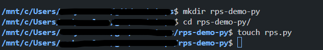

Open the file in your code editor (VS Code is being used in the sample screenshots) and enter a starting prompt:

```
'''
Create a Python application that allows a user to play Rock, Paper, Scissors against a computer player.
'''
```
Accept prompts provided, you should receive suggestions similar to the screenshot:
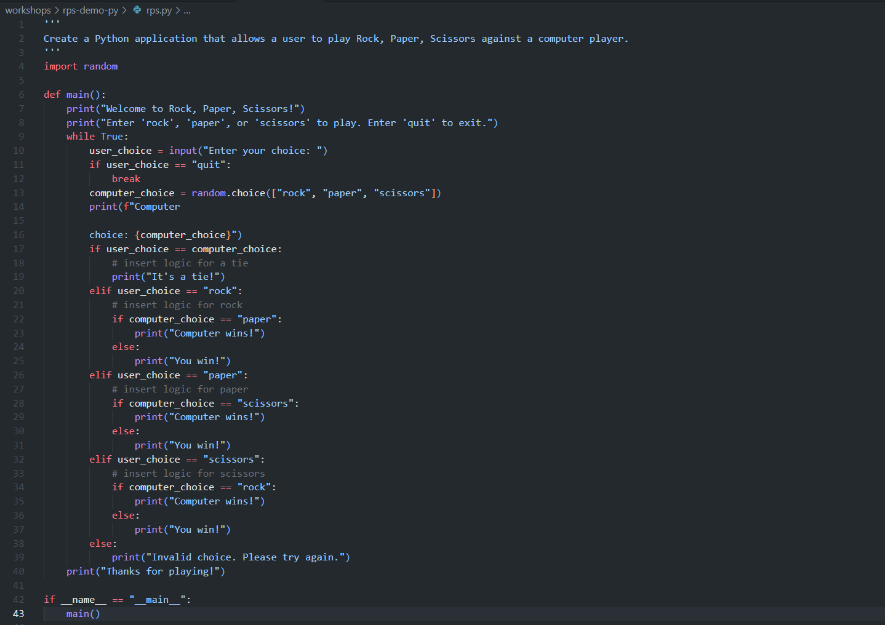

Test the application for functionality:

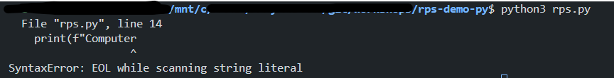

In this case, it produced an error.  This can showcase how we can use GitHub Copilot to help us troubleshoot errors.  The error message can be provided as added information to our context in the prompt:

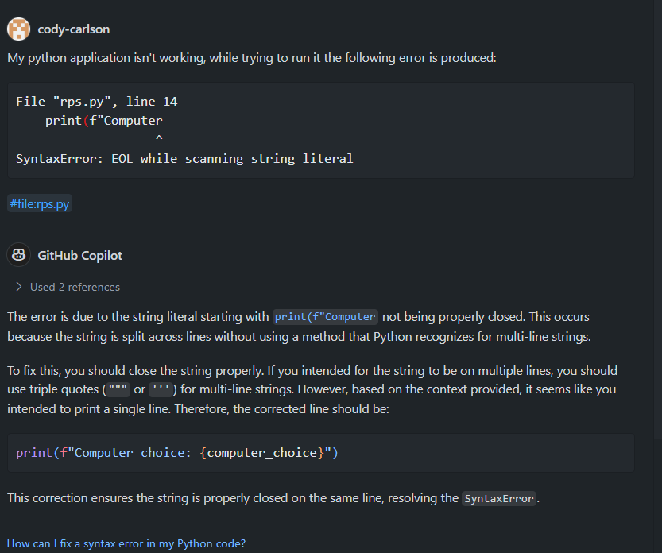

Having implemented Github Copilot's recommended fix, we should now have a working, basic version, of the game:

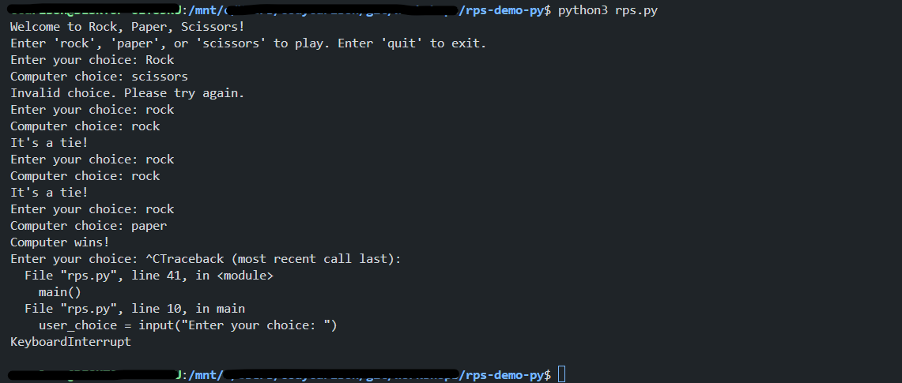

Consider an alternate prompt with additional information and criteria:
```
'''
Create a Python application that allows a user to play Rock, Paper, Scissors against a computer player. The application should do the following:

1. Display the welcome message.
2. Prompt the user to enter their name.
3. Display the rules of the game.
4. Prompt the user to select Rock, Paper, or Scissors.
5. Generate a random selection for the computer player.
6. Display the user's selection and the computer's selection.
7. Determine the winner of the game.
8. Display the winner of the game.
9. Prompt the user to play again.
10. Display the goodbye message.
'''
```

### Add Functionality
Create prompts to add the following features:

- Prompt user for yes/no prompt after each round
- Input validation for all user prompts and inputs
- Add ASCII art for each round and user/computer selection
- Ask GitHub Copilot to consider breaking into separate methods instead of 1-2 methods to 'rule them all'

#### Examples:

Adding Keep Score Mechanic:

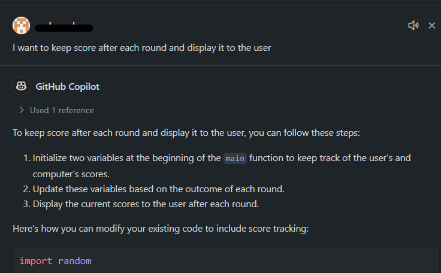

Play again after a round:

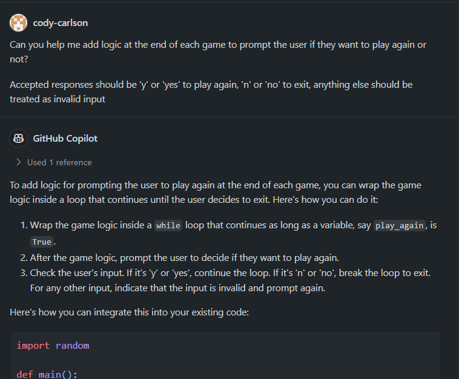

Troubleshooting undesired behavior with play again:

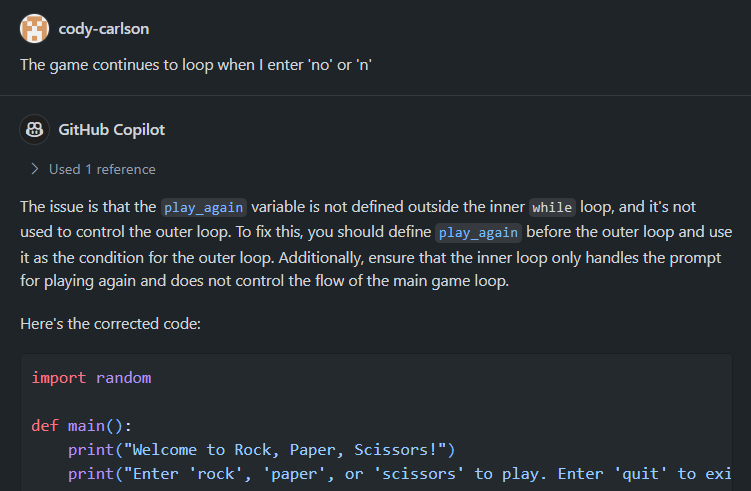

ASCII Art:

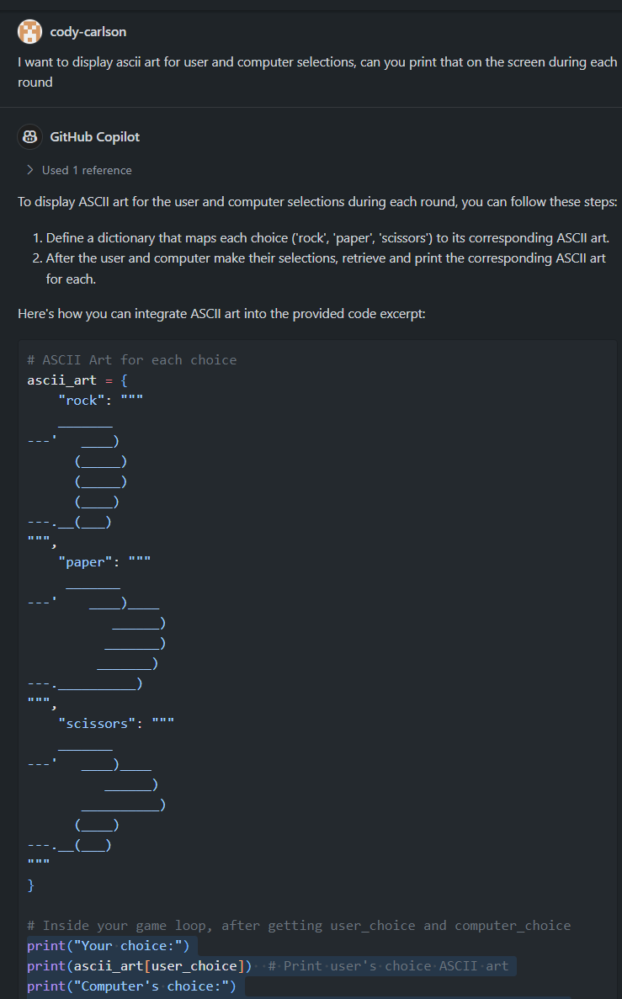


</details>

<details>
<summary><strong>Lab 2</strong></summary>

## Refactoring
Now that we've implemented basic game functionality and added features to enhance the capabilities in line with user and business expectations, we can work on making code more efficient.

In this lab, our goals are to show how GitHub Copilot can assist with these goals:
- Breaking game logic in to classes to better encapsulate functionality and improve code organization.
- Ensuring end user functionality remains unchanged after refactoring to ensure the game operates as expected.
- Plan for future test case scenarios

Prompt:
```
Can you help me refactor the program to use classes?  My future use cases will require unit testing of the code, I need to make it more efficient and scalable.  I want the classes to be in separate files and imported/exported appropriately
```

Output should be similar to the following:

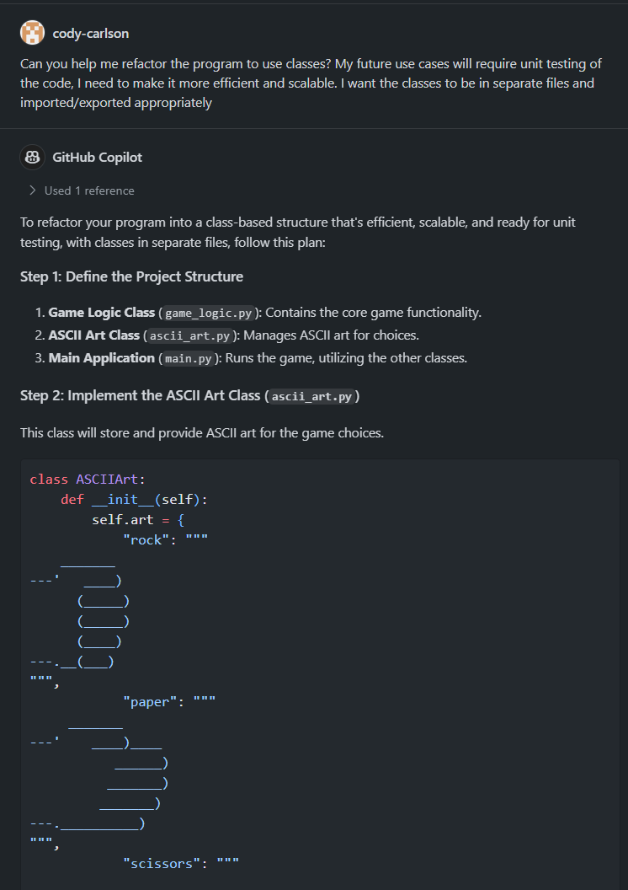

After refactoring, we can re-test and ensure the program functions as intended:

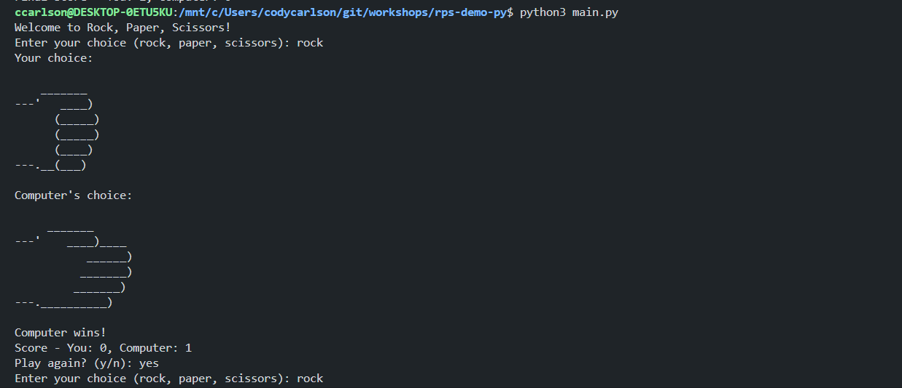

After refactoring, I noticed that GitHub Copilot said if I wanted to use a project structure it would recommend something different.  Let's ask it what it thinks about re-organizing our files into a project structure...

Prompt:
```
If I wanted to use a package structure, how could I store the files to match that?
```

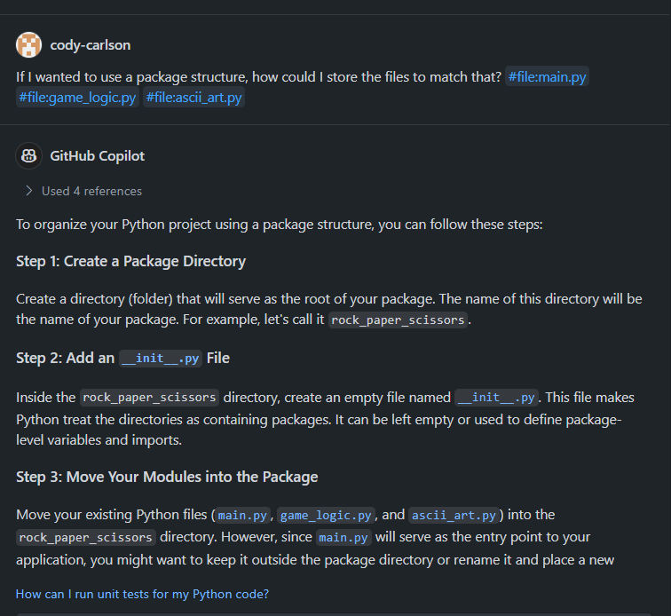
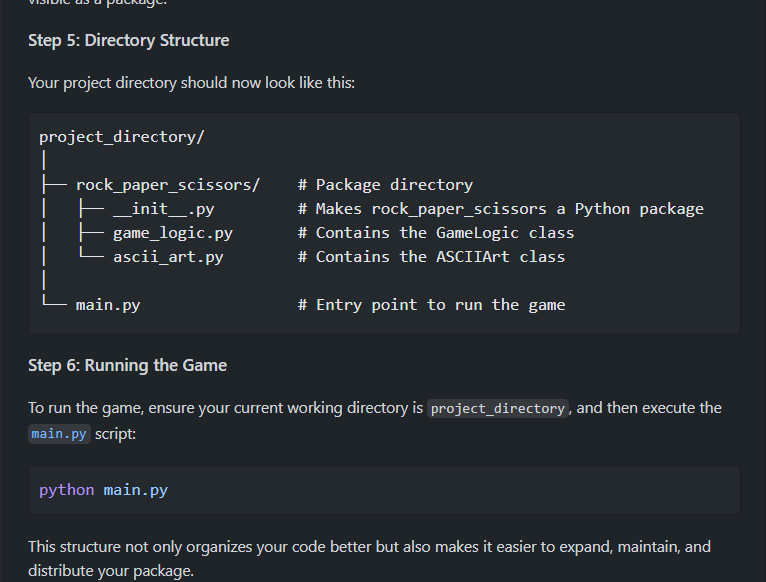

Use copilot to help correct any errors, and don't hesitate to use the ```#file``` switch on your prompts to specifically include certail files.
Reference GitHub Copilot / commands and # commands with official documentation [here](https://docs.github.com/en/copilot/github-copilot-chat/copilot-chat-in-ides/using-github-copilot-chat-in-your-ide?tool=vscode#slash-commands).


</details>

<details>
<summary><strong>Lab 3</strong></summary>

## Testing
- Tests are built in a separate class/file(s) to maintain a clear distinction between game logic and testing logic.
- A testing framework is installed to facilitate automated testing.
- Testing is thoroughly conducted to troubleshoot and fix errors, ensuring reliability.

</details>

<details>
<summary><strong>Lab 4</strong></summary>

## Documentation
- Comprehensive comments are added to the code to explain the functionality and logic, making it easier for new developers to understand.
- A detailed README.md is provided to guide users on the proper setup and use of the game, including installation, requirements, and how to play.

</details>